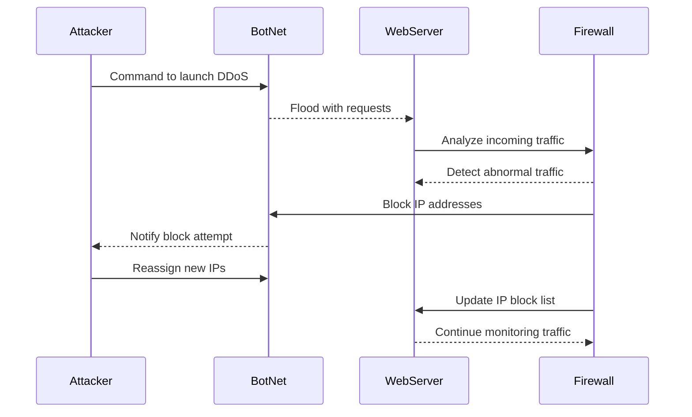

Sequence Diagram Explanation:

1. Attacker starts the attack:
The Attacker tells the BotNet to attack the WebServer by sending a lot of requests all at once.

2. BotNet sends too many requests:
The BotNet is made up of many hacked devices. It sends a huge amount of requests to the WebServer, trying to make it slow down or stop working.

3. WebServer sees something is wrong:
The WebServer gets too much traffic and knows something is off. It asks the Firewall to check what’s going on.

4. Firewall finds the attack:
The Firewall looks at the traffic and sees that it’s a DDoS attack. It notices a lot of repeated requests, which means the BotNet is attacking.

5. Firewall blocks the bad traffic:
The Firewall blocks the IP addresses of the devices sending too many requests to stop them from reaching the WebServer.

6. BotNet tells the attacker:
The BotNet notices that the WebServer isn’t getting the requests anymore and tells the Attacker it’s being blocked.

7. Attacker changes IPs:
The Attacker gives the BotNet new IP addresses to try and get past the Firewall block.

8. Firewall blocks the new IPs:
The Firewall sees the new IP addresses and blocks them too, making sure the attack doesn’t continue.

9. WebServer keeps watching:
The WebServer and Firewall keep checking the traffic to make sure the BotNet can’t attack again.
